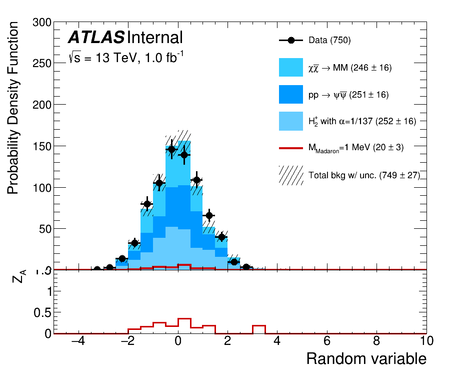

# High quality HEP plotting

This code allows to produce, in a very flexible way, publication quality HEP distributions
based on ROOT histograms.

## 1. Installation

```
git clone https://github.com/rmadar/hepplotting
cd hepplotting
pip install -e . --user
```

## 2. Usage

### 2.1 Needed inputs

1. Histograms for every processes and data, and total histogram (for the uncertainty)
2. Legend names and color definitions for every background
3. Possibly every systematic variations to be passed through the total histogram
(after appropriate combination across systematics, which is not performed by this tool)

### 2.2 Simplest example

The simplest use you can do is to call the following function, once you get your
histograms (with their color):
```
import hepplotting as plt
plt.make_nice_canvas(dictBkg,hTot,hData,plot_name='myplot')
```
where:
  + `dictBkg` is a dictionnary made of background name and the corresponding histogram `{bname:[TH1F,color,leg_name]}`
  + `hTot` is the total histogram with possibly larger uncertainty (to account for systematics)
  + `hData` is the data histograms

A concrete example can be found in [this notebook](example/example.ipynb) (consider reading the
[known issues section](#known-issues) for notebook use) or [this simple script](example/example.py)
which produce each this plot:




### 2.3 Description of the options

The point of this tool is to be able to highly tune many details on a plot-by-plot level,
which is often required during the approval process of a publication.


**Histogram properties**

   + `dictSig` [dict {sigName:[TH1,color,norm,legName]}] is dictionnary with name [string], histo [TH1], color [int], norm [float] and legName [string] of several signals
   + `m_size` [float] is the marker size for data
   + `error_fill` [int] is the filling style for the uncertainty band
   + `error_alpha` [float] is the transparency for the uncertainty band (in [0,1])
   + `histo_border` [int] is the border size of background histograms in the stacks


**Axis properties**

   + `xtitle` [string] is x-axis title
   + `ytitle` [string] is y-axis title
   + `xmin` [float] lower x-axis value
   + `ymin` [float] lower y-axis value
   + `ymax` [float] higher y-axis value
   + `r_ymin` [float] lower y-axis value on the ratio plot
   + `r_ymax` [float] higher y-axis value on the ratio plot
   + `xticksInt` [bool] keep only integer values for x-axis ticks
   + `bin_label` [list of string] to name bins (e.g plots with one region yield per bin)
   + `xlabel_size` [float] size of the x-axis bin labels
   + `xlabel_offset` [float] offset of the x-axis bin labels


**Canvas properties**

   + `plot_ratio` [boolean] to plot or not the ratio panel
   + `is_logy` [boolean] to plot in log scale or not
   + `can_ratio` [float] specify the canvas size such as width=900/ratio and height=800
   + `leg_pos` [list of float] specify the legend position via bottom left (x1,y1) and top right (x2,y2) using [x1,y1,x2,y2]
   + `unc_leg` [string] to tune the name of uncertainty (eg. stat-only)
   + `plot_labels` [list of string] given the labels printed below ATLAS and Lumi
   + `atlas_label` [string] is 'Internal' by default but can be 'ATLAS', 'Preliminary', 'Simulation'


**Output properties**

   + `plotdir` [string] is a directory where the plots will be stored (default: 'plots')


## 3 Technical comments

### 3.1 Dependencies

  + ROOT
  

### 3.2 Known issues

The notebook example doesn't seem to work well and all setup. Several minor features are not working properly
  + the magic command `autoreload` doesn't work (nothing to do with this pacakge)
  + in the notebook, the displayed canvas is not correct (should be connected to ROOT-related tool versions). This affect the 
  use of the tool *within a notebooks* only*.
